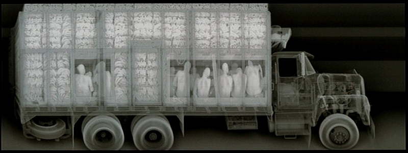

# Multispectral & Hyperspectral Imaging

[*Multispectral imaging*](https://en.wikipedia.org/wiki/Multispectral_image) employs additional channels of electromagnetic radiation beyond human perception, such as infrared (IR), ultraviolet (UV), X-rays, and more. 

[*Hyperspectral imaging*](https://en.wikipedia.org/wiki/Hyperspectral_imaging) attempts to capture the entire reflective or emissive spectrum for every pixel, essentially representing an image with a three-dimensional (x,y,λ) data cube.

--- 

### What does it look like? 

*A face simultaneously imaged in the (a) visible spectrum, 0.4–0.7 µm, (b) short-wave infrared, 1.0–3.0µm, (c) mid-wave infrared, 3.0–5.0µm, and (d) long-wave infrared, 8.0-14.0µm.*

* [An excellent paper on multispectral face recognition](http://www.intechopen.com/books/reviews-refinements-and-new-ideas-in-face-recognition/thermal-infrared-face-recognition-a-biometric-identification-technique-for-robust-security-system)
* [Differences between UV, Vis, NIR (Wikipedia)](https://en.wikipedia.org/wiki/Full-spectrum_photography#/media/File:UV_Vis_IR_Portrait.jpg)
* [More](https://www.flickr.com/photos/rshephorse/4279928945)

--- 

### Some applications

* Satellites employ multispectral imaging to understand the Earth. [Charlie Loyd, Putting Landsat8's multispectral imaging to work.](https://www.mapbox.com/blog/putting-landsat-8-bands-to-work/) 
* Astronomers use multispectral imaging to [understand the Sun](http://www.nasa.gov/images/content/719688main_Sun-Wavelength-Chart_full.jpg). 
* Forensic specialists use infrared and ultraviolet imaging and/or fluorescence to [recover writing lost to water damage](https://people.rit.edu/andpph/photofile-b/ir-letter-comparison-1.jpg), [analyze medieval frescoes](https://artcosnervationcsmodotcom.wordpress.com/category/rti/), [detect fraudulent documents](https://www.fbi.gov/about-us/lab/forensic-science-communications/fsc/oct1999/images/inkglowb.jpg), [determine the provenance of artifacts](https://www.fbi.gov/about-us/lab/forensic-science-communications/fsc/oct1999/images/matchb.jpg), [sort fragments of shredded documents](https://www.fbi.gov/about-us/lab/forensic-science-communications/fsc/oct1999/images/shredb.jpg), [detect underpaintings in famous artworks](http://www.artic.edu/collections/conservation/revealing-picasso-conservation-project/examination-techniques/infrared), [detecting previous versions of artworks](http://www.webexhibits.org/pigments/intro/visible.html).

---

### Near-Infrared (NIR) Imaging

Widely used in security cameras. 

* You can [see veins easily](https://www.flickr.com/photos/nebarnix/2034727799) in NIR.
* This has been used in some medical AR applications, such as the Christie [VeinViewer](http://www.bayareahospital.org/Images/IV_Insertions_Get_Easier_For_Patients.aspx) device. 
* In some circumstances, depending on materials, NIR cameras can [kindof see through clothes](http://www.komonews.com/news/problemsolvers/94802064.html). 
* [Detecting traced signatures](https://www.fbi.gov/about-us/lab/forensic-science-communications/fsc/oct1999/images/tracingb.jpg)
* Osman Khan created a strictly [IR-viewable image](http://www.osmankhan.com/works.asp?name=Unviewed).
* The paintings [*"The Lynching of Leo Frank"*](http://www.oliverlutz.com/oliverlutz_prjct_lfrnk.htm) and [*"Stella at the Playground"*](http://www.oliverlutz.com/oliverlutz_prjct_plygrnd_inst.htm) by Oliver Lutz (2010) use a (visibly) black acrylic overpainting covering a secret image that can only be observed by a NIR security camera and a nearby CCTV. Lutz makes [many projects](http://www.oliverlutz.com/oliverlutz_prjct_nscr.htm) with this IR-clear, visibly-black overpainting. His work appeared in the exhibition [*"Exposed: Voyeurism, Surveillance and The Camera since 1870"*](http://www.walkerart.org/calendar/2011/exposed-voyeurism-surveillance-and-the-camera). 

---

### X-Ray imaging

* [X-ray portraits by Ayako Kanda and Mayuka Hayashi](http://www.boredpanda.com/x-ray-couple-portraits-ayako-kanda-mayuka-hayashi/)
* [*Lick* by Wim Delvoye](http://curiator.com/art/wim-delvoye/lick-1)
* [*Pinup Calendar* by German ad firm, BUTTER](http://www.themarysue.com/x-ray-pin-up-calendar/)
* [Xograms, by Hugh Turvey](http://www.smithsonianmag.com/arts-culture/x-ray-art-deeper-look-everyday-objects-180949540/?no-ist)
* [*X-Ray Photographic Art* (Survey)](http://www.theapricity.com/forum/showthread.php?147702-X-Ray-Photographic-Art-Seeing-Humans-Nature-Objects-Beneath-The-Surface)

---

### Thermal Imaging 

* [Satellite thermal imaging of roofs](http://mashable.com/2015/08/20/google-house-solar/?utm_cid=mash-com-fb-main-link)
* [THE OPERATION by Jacob Pander and Marne Lucas, 1995](https://vimeo.com/24149525) (NSFW)
* [Route 94: *My Love*](https://vimeo.com/84702235)
* [This Photographer Shoots Portraits With a Thermal Camera](http://www.smithsonianmag.com/science-nature/this-photographer-shoots-portraits-with-a-thermal-camera-1437109/)
  * [Linda Alterwitz 1](http://www.lindaalterwitz.com/thermal_portrait.html)
  * [Linda Alterwitz 2](http://www.lindaalterwitz.com/thermal_core.html)

---

### Thermochromic Imaging

Some substances temporarily change color in response to heat. 

* [*Thermochromic Table*, Jay Watson design, 2011](http://www.fubiz.net/en/2014/02/21/thermochromic-table/)
* [*Temperature Sensitive Object*, Archilab, Orléans, France, 2001](http://www.mascontext.com/wp-content/uploads/2011/12/12_game_ornaments_09.jpg)
* [Thermochromic toilet](http://theluxuryofprotest.com/Thermochromic_Toilet_Seat.html)
* [Thermochromic urinal](http://www.technocrazed.com/wp-content/uploads/2014/08/New-Thermochromic-Furniture-And-Pots-11.jpg)

---

### Ultraviolet (UV) Imaging 

#### Ultraviolet animal vision. 

* Many animals [can see in the ultraviolet](http://www.theatlantic.com/technology/archive/2011/08/6-animals-that-can-see-or-glow-in-ultraviolet-light/243634/). 
* [Spectra of different species' vision](https://fieldguidetohummingbirds.files.wordpress.com/2008/11/spectrum.jpg).
* [Birds & bees' UV vision](http://www.nature.com/scitable/blog/the-artful-brain/alternate_realities)

UV is also [widely used in forensics](http://ultravioletcameras.com/applications/longwave-ultraviolet-forensics-imaging-applications/). 

#### Artworks using UV

* [UV video overview](https://www.youtube.com/watch?v=o9BqrSAHbTc)
* [Thomas Leveritt, *Nivea Australia spot*](http://www.leveritt.com/page-uv/)
* [UV portraits by Cara Phillips](http://www.theguardian.com/artanddesign/gallery/2012/aug/03/ultraviolet-beauties-cara-phillips-photographs)

#### UV imaging in practice

* [UV-pass, visible-cut filters](http://www.savazzi.net/photography/baader_u.htm) are available. 
* It is also relatively inexpensive to have a [Canon SLR permanently converted for UV](http://www.lifepixel.com/shop/ultraviolet-camera-conversion/canon-dslr-uv-camera-conversion). 
* It is [worth pointing out](http://www.savazzi.net/photography/uv.htm) that UV & NIR photography also benefit from using [special lenses](http://www.savazzi.net/photography/coastalopt_60.html) which better focus these wavelengths. 
* Of course, [dedicated UV cameras](http://www.edmundoptics.com/cameras/nir-uv-cameras/sony-xc-e-series-monochrome-ccd-cameras/56346/) also exist. 

--- 
### And Beyond...

#### Millimeter Wave & Terahertz Imaging

This is the stuff that *really* sees through clothing. 

* [Millimeter wave scanners](https://en.wikipedia.org/wiki/Full_body_scanner#Controversies), also called backscatter imaging, are used by the TSA 
* [Terahertz imagers](http://www.stamparein3d.it/wp-content/uploads/2015/04/Lenti-a-Onde-THZ-05.jpg), which operate around 300 micrometers.

Indeed, it can see through [more than just clothing](http://www.propublica.org/article/drive-by-scanning-officials-expand-use-and-dose-of-radiation-for-security-s). 

*"Treating people like luggage"*

#### CT Scans, MRI, CAT etc. 

X-ray computed tomography (X-ray CT) and magnetic resonance imaging (MRI) and are medical imaging techniques that employ significant computation to produce 3D models of internal body structures and activities. Perhaps if you have a good reason, you can get a scan of yourself at the hospital. 

*Kyle McDonald experimenting with some of his own CT scan data in openFrameworks.*

