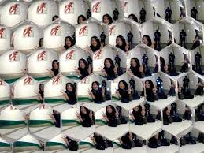
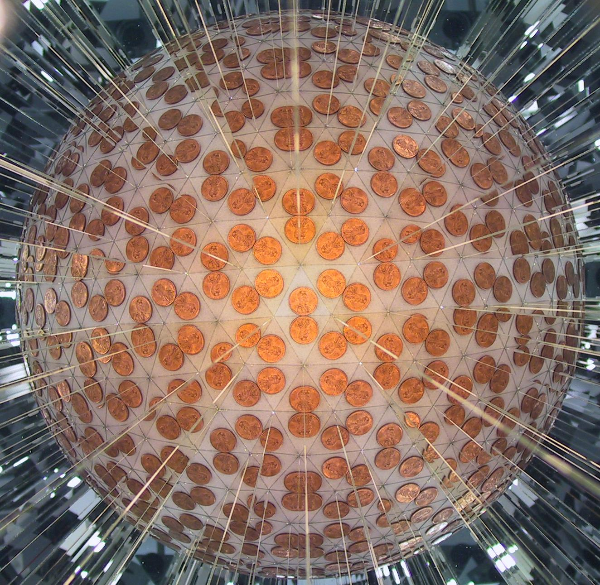

### Imaging in Reflective Surfaces

* Spherical mirror arrays, which capture a scene from many simultaneous perspectives, [allow for interesting possibilities](http://yuichitaguchi.com/project/AxialCones/), including distortion correction, digital refocusing for artistic depth of field effects in wide-angle scenes, and wide-angle dense depth estimation.

* Images of what someone is looking at can be recovered from reflections in their eyes. [Identifiable Images of Bystanders Extracted from Corneal Reflections](http://journals.plos.org/plosone/article?id=10.1371/journal.pone.0083325) (Rob Jenkins, Christie Kerr)
http://motherboard.vice.com/blog/humans-are-really-good-at-facial-recognition

* Surface reflectance can also be recovered using a *tapered kaleidoscope*, as in [this work by Ken Perlin and Jeff Han](http://mrl.nyu.edu/~perlin/cat-talks/kaleidoscope/#2)

