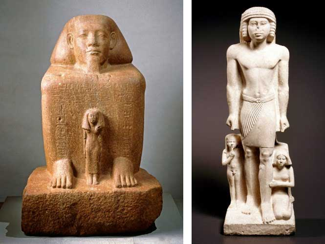
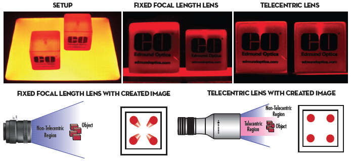
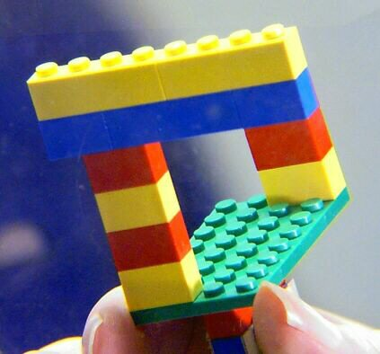

# Perspective Capture and Imaging

### Perspective Representation

Size = Proximity.

 
*Forced perspective by [mtsonic](https://www.flickr.com/photos/mtsonic/2933383930/).*

Owing to our familiarity with perspective imaging, we take for granted that things which are larger, are closer. (When we play with this notion, it's called [*forced perspective*](http://naldzgraphics.net/photography/forced-perspective-photos/).) But it wasn't always this way, and it doesn't have to be. 

### Hierarchical size 

Size = Importance.

*At left, from [here](http://www.curatorscorner.com/2014_10_01_archive.html?m=1): "Senwosret-senebefny, an Egyptian official in the Twelfth Dynasty (1937–1759 bce), depict the deceased squatting on the ground covered in a cloak. The small figure is Itneferuseneb, most likely Senwosret-senebefny’s wife." At right: Family Group, mortuary statue, ca 2371–2298 bce.*

This is *psychological* rather than *mechanical* representation.

### Perspectiveless Imaging

Size = A Question of Composition

The "lack" of perspective is a common feature in Asian, Indian, and Medieval European art. Notice how the characters are all the same size, even if they are further away. Well, "further away" from what? Who (or what) is the implied observer here? 

*[Akbar Inspecting the Construction of Fatehpur-Sikri](http://www-personal.umich.edu/~pomorski/mug1.html)*, Mughal empire, India (c. 1590).

It's important to remember that *perspective is an invented technology for representing the 3D world in two dimensions*. It was invented in 1435, by Leon Battista Alberti (1404-1472), who provided the first theory of what we now call linear perspective in his book, *On Painting.* After 1435, the technology spread rapidly throughout Europe. 

*The Last Supper*, by Ugolino De Nerio (circa 1325), and Leonardo Da Vinci (circa 1494).

### Orthographic/Isometric and Other Projections 

Furthermore, just because you have 3D-dimensional data, it doesn't mean that it must be rendered with perspective. *Perspective projection is simply the default rendering mode in OpenGL and DirectX.* 

 
Orthographic perspective in *Gangster Squad*.

In fact, there are a wide variety of alternative graphical projection methods, including orthographic () mode, above (also called isometric or "ortho"), and more. (For orthographic projection in openFrameworks, see [ofCamera](http://openframeworks.cc/documentation/3d/ofCamera.html) and [ofEnableOrtho()](http://openframeworks.cc/documentation/3d/ofCamera.html#show_enableOrtho).)

*Alternative graphical projection methods.*

### Telecentric Lenses

A [*telecentric lens*](https://en.wikipedia.org/wiki/Telecentric_lens) is an unusual type of lens whose focal point is at infinity. It naturally produces an orthographic view of its subject. 

 
*Telecentric imaging, from Edmund Optics.*

 
*Illusion picture made with a digital camera and a telecentric lens system, [from here](http://www.lhup.edu/~dsimanek/3d/telecent.htm).*

