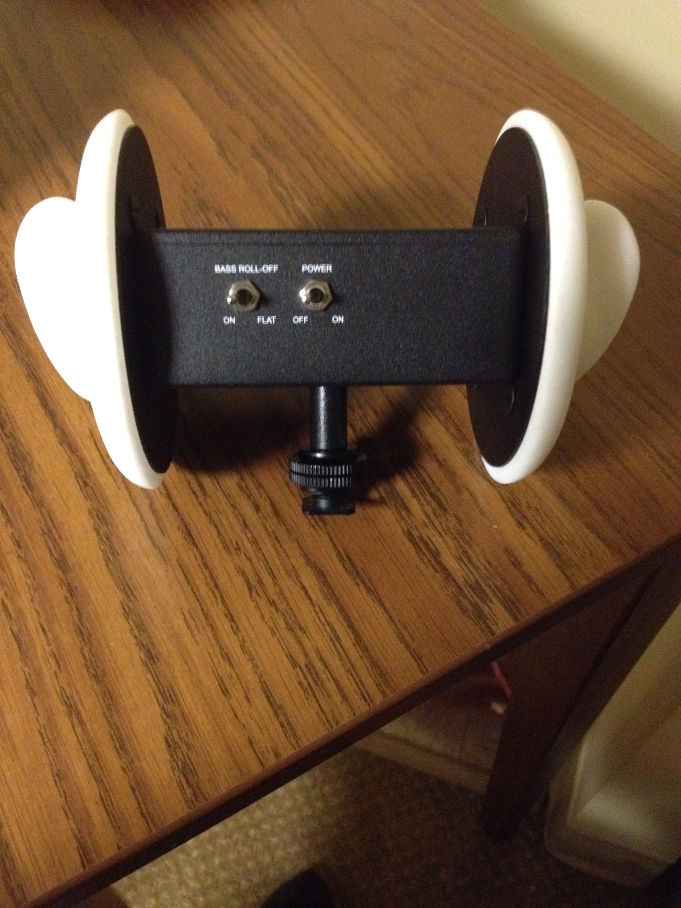
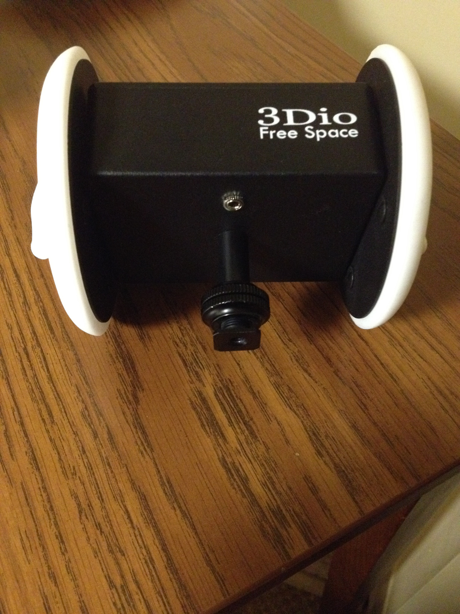
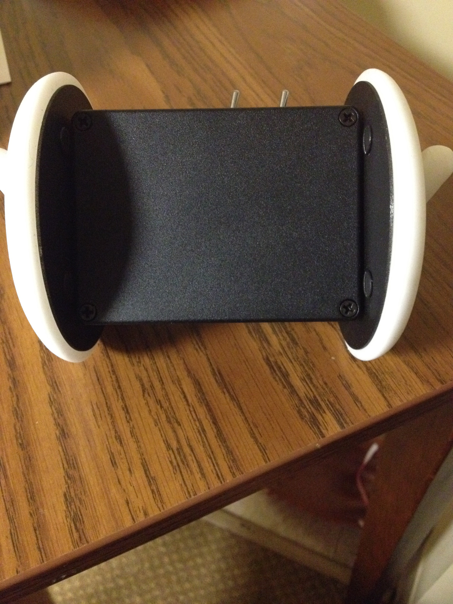

#3Dio Free Space Tutorial
By Kevin M. Karol
Spetember 2, 2015

### About the 3Dio Free Space

The Free Space is a binuarl microphone manufactured by 3Dio and sold by J.TESORI in Japan.  It is the base model in a line that includes the Free Space Pro II, which is very similar to the Free Space with slight material and technical refinements for maximum quality recording, and the Free Space Omni, which simulates 360 degree binural audio using 8 different microphones mounted in a circle for interactive recordings.  Although the model available through the Studio for Creative Inquery doesn't include it, a model of the Free Space is available with XLR Phantom Power Output.

3Dio also has additional silicone ears that are identical to those used on the Free Space available for purchase for custome binuaral dummy heads/recording setups.

### About Binaural Microphones

Binaural recording is a technique whereby two or more microphones are placed the same distance apart as the human ears.  By recording a stereo track on these microphones, it is possible to simulate highly realistic 3D sound when playedback later over headphones.  The delay in the recordings between the ears directly mirrors the Head-related transfer function that the brain uses to identify where sound is coming from, and so with no additional processing the track takes on a level of realism standard recording doesn't capture.

One of the limiting factors of Binural recording is that for the head-related transfer function to be properly simulated, the track must be played back using headphones, rather than stereo speakers which would introduce a second confounding layer of delays.  Ambiophonic processing can sometimes improve the playback through speakers for a limited area near the speakers.

### About This Tutorial
A wonderfull in-depth tutorial for the 3Dio is provided on [their website](http://3diosound.com/instructions_introduction.php).  This document should instead be viewed as a Quick-start guide and general introduction to Binuaral Recording

### 3Dio Interface

The 3Dio is a fairly simple device to operate.  The control panel has two switches: a power switch and a bass roll-off switch.  

The power switch controls the battery usage - it should be in the off position whenever you are not recording with the 3Dio.
The bass roll-off switch controls how much noise filtering happens at the microphone level.  If you are in a relatively quite environment it should be left off, whereas if there is constant noise of an air conditioner or wind, the microphone can filter these constant drones automatically.

On the bottom of 3Dio is a standard 1/8" stereo audio jack.

And when the battery runs out, the top can be removed to replace the 9-volt battery that powers the microphone.

Most of the complexity lies in optomizing recording quality, as with any microphone system, and that is primarily dependent on how you place and mount the microphone within the space.

### Recording audio with the 3Dio

Simply connect the 3Dio microphone to a recording device, decide on your Bas Roll-Off setting, and flip the power switch to on.

### Sources

The information in this tutorial comes from:
http://3diosound.com/instructions_introduction.php
https://en.wikipedia.org/wiki/Binaural_recording
https://en.wikipedia.org/wiki/Ambiophonics
https://en.wikipedia.org/wiki/Head-related_transfer_function
http://www.bbc.co.uk/blogs/researchanddevelopment/2013/03/listen-up-binaural-sound.shtml
